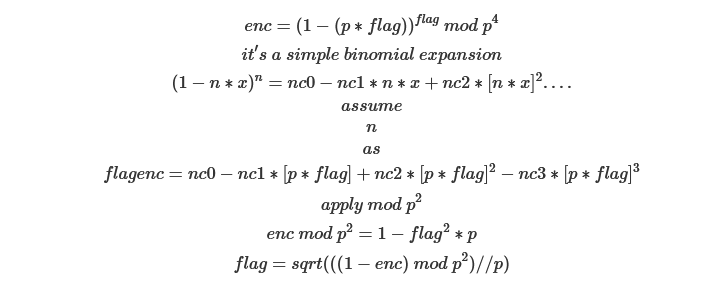

```py
from gmpy2 import *
from Crypto.Util.number import *
enc =0x73c6ac5135932b70810b180865ff56b879f753869d29ade04f27692b9ac27d13aec84d3f68ca07aab5e0f5996ac139b6df45e7991910e4b38ade16c9065cfc508322a1c1c94e63bc49cf7079b5ddc2f23121674b5617289d5e5de109212c35f4e953f710c8f96b829409e2d158eb3d25a179e482c0b7a9b8d677824c2fa5685eb07c1c175c6584fce74972c66511d300c6596999a5e624be029b9194c6adb06a495c4740eec282da2e7ee0cfec57afb11f7a746480243d3171732963de31f1fa2e570af9ab12bccae53fed1b22006b5446422d6bccb594cbfb62f8c19b482253f4da3b6a91038d9c2f6640f0d5b806f2f0f4148e03e48a218e7d89be1807aff5d26d613b8f1c242d12a7f555de8625bf687d483e303b85dbb04545fb6c5737887e38be2ca8db05c412f8a6fb47e028aad324a08ec40ea01e813a77e88739cf5008f588ba37a2c3e6dcb7d07fa479afc54a5bfb7487a80692dc3a8486bd0a7b1bfbdaf50e2d86d894e197bc22d45416b53074dc83046b66bf969edce8d8573bbd3371be79accf8b662b6f9e253f3da5126958346ce5c081b7e76285c4d1d73b37fe441ac3c7d9892e5ed5a4cd8d559193d03c1f63f2b967184df77abaa989b951eb829de36a6fd4a534f2f9ac6af9a6971e26a60de25ec95a3e4ead8284754083edf2194269d81f69bc80cf2e8c10a9584bd81ed9b0b1d491c93b44ebea87d78bd041a5717bae7c48a6075fed9bcf5faec796cc3381d9a348267a406cfe0286ad04b77ff4565e215e40863e866d04172597fd7f2ec1412a0c5845ed0453df54d765b70214f866d797e9dc01c75b7f9587913b5989429158f46db7c5308a7cb1fa2e0f1c779cf9b92d4496d9ce1aee05d0d76444a8b240a72aee0a88967ee44841cc2abb3afa779f2053827b04b4054b55b658156a1f42ffe988c88efce660fe83d248af33e2796b0c176caecc50380ae70e08ee2c2f7e6a8aea34da53173b76055417ffff8dc87cb867d09d34ff0273e633fe9344350d6b90f5416e567968dafe7acea7711af067a105e5e0df26ce2ff52a364610fe1b4cae4086865b5c6c880f5c4cd966f6bdd4acc3356061911b73bada30c19d9872eb471634e8ee404af09a3c2342f2149dd3b2000d6c041aa4211e183c1b58b12f4652d57b02c663f0ecf46d36a43b78b928ef7f91f761870ce47e184a94f99bd9e1259ab69517a5c622bda56ca2430a9c80a6d0d92da9fc7d61476d1ed49578020d37195588c6c8c7a54c9b06ff626e55777553c8fe532aa83a52cb71aa90e747584d04b0e1de4468e7ec1f4b416f526ffa567114cc47b507f769da38838d6051e822700de020547182e6ee765f2640f861811d709b72ea01f30910478672fcc2dcdeea1c5d91e5b17d24f4e4cc5590e4bef3205f9105b160723df3565cff76c85885ac8967e42ae133b3
p= 0xd1ef5688fd21f38b1a31aacaabe90345e0d3a731916024e1e34ef73867caccae14914d5d499775ceaf66d4c6df5a79e629adaa7f89bd2d28a70040fc194155f5d258e3e22149d7b1e9712d5af29911a4522829eacef736f1decd766697cb7da7ef4d89865637a67e7327550de416c32450fddac30aa101e117ea81a99daa5c4233f9d536281b9df24ccaf9f8bcbdd7bce22d7da60bc1af1e61c8e8cc62541ed256620d3756146538281e5db56e5934e72bfbb2c33c58f0d35aee72244be1d3750bdccbbccb2cfbe4daf694fceac1c93af699fb43988ecc37404fa794fa368c00c632446536d4b8e45ccafd136941887d62c44b367998bcf3646bcfb12e3f11d3
k=((1-enc)%p**2)//p
print(long_to_bytes(iroot(k,2)[0]))
```